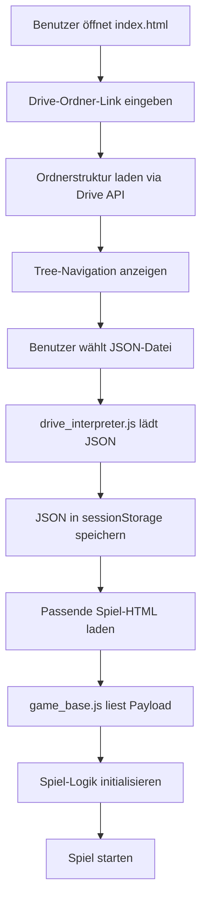

# 🎮 DriveGames - Interaktive Bildungs-Plattform


Eine moderne, webbasierte Plattform für interaktive Lernspiele, die dynamisch aus Google Drive geladen werden.

---

## 📋 Inhaltsverzeichnis

- [Über das Projekt](#-über-das-projekt)
- [Features](#-features)
- [Technologie-Stack](#-technologie-stack)
- [Projekt-Architektur](#-projekt-architektur)
- [Installation & Setup](#-installation--setup)
- [Verwendung](#-verwendung)
- [Google Drive Integration](#-google-drive-integration)
- [Spiele-Entwicklung](#-spiele-entwicklung)
- [Theme-System](#-theme-system)
- [Deployment](#-deployment)
- [Fehlerbehebung](#-fehlerbehebung)
- [Erweiterte Themen](#-erweiterte-themen)

---

## 🎯 Über das Projekt

**DriveGames** ist eine Single-Page-Application (SPA), die es ermöglicht, interaktive Lernspiele aus einem Google Drive-Ordner zu laden und im Browser zu spielen. Die Plattform ist perfekt für Lehrkräfte, Trainer und Content-Ersteller, die:

- 📚 Bildungsinhalte interaktiv gestalten möchten
- 🔄 Inhalte ohne Code-Änderungen aktualisieren wollen
- 🌐 Eine einfach zu bedienende Web-Plattform benötigen
- 🎨 Ein modernes, ansprechendes Design bevorzugen

### Hauptmerkmale

- **Keine Backend-Infrastruktur**: Alles läuft im Browser
- **Content aus der Cloud**: Spiele werden aus Google Drive geladen
- **Modernes Design**: Glassmorphism mit Dark/Light Mode
- **Responsiv**: Funktioniert auf Desktop und Mobile
- **Erweiterbar**: Einfach neue Spieltypen hinzufügen

---

## ✨ Features

### 🎮 Verfügbare Spiele

1. **Escape Game** (`escape_game`)
   - Zeitbasiertes Rätselspiel mit mehreren Herausforderungen
   - Drag-and-Drop Sortieraufgaben
   - Multiple-Choice Quizze
   - Zuordnungsaufgaben

2. **Quick Quiz** (`quick_quiz`)
   - Schnelles Frage-Antwort-Spiel
   - Timer-basiert mit Scoring
   - Highscore-Tracking

3. **Matching Puzzle** (`matching_puzzle`)
   - Paar-Zuordnungsspiel
   - Bildunterstützt

4. **Sortier-Spiel** (`sortier_spiel`)
   - Kategorisierungs-Aufgaben
   - Drag-and-Drop Interface

5. **"Wer bin ich?"** (`wer_bin_ich`)
   - Ratespiel mit Hinweisen
   - Punktesystem

### 🎨 UI/UX Features

- **Glassmorphism Design**: Moderne, halbtransparente UI-Elemente
- **Dark/Light Mode**: Vollständige Theme-Unterstützung
- **Neon-Glows**: Cyber-ästhetische Akzente
- **Smooth Animations**: GPU-beschleunigte Übergänge
- **Responsive Layout**: Optimiert für alle Bildschirmgrößen

### 🛠 Technische Features

- **Google Drive API Integration**: Dynamisches Laden von Inhalten
- **SessionStorage Caching**: Schnelle Performance
- **State Persistence**: LocalStorage für Benutzerpräferenzen
- **Error Handling**: Aussagekräftige Fehlermeldungen
- **Modular Architecture**: Wiederverwendbare Komponenten

---

## 🔧 Technologie-Stack

### Frontend
- **HTML5**: Semantisches Markup
- **CSS3**: Custom Properties, Glassmorphism, Animationen
- **Vanilla JavaScript**: ES6+, Klassen, async/await
- **Google Drive API v3**: Content-Management

### Build & Deployment
- **Kein Build-Prozess**: Direkt lauffähig
- **GitHub Pages**: Static Hosting
- **Git**: Versionskontrolle

### Browser-Kompatibilität
- Chrome/Edge 90+
- Firefox 88+
- Safari 14+
- Opera 76+

---

## 🏗 Projekt-Architektur

### Ordnerstruktur

```
DriveGames/
├── index.html              # Haupt-SPA mit Welcome Screen
├── debugg.html             # Debug-Version (deprecated)
├── index.js                # Hauptlogik für debugg.html
├── index.css               # Zusätzliche Styles
├── config.js               # Google Drive API-Konfiguration
├── drive_interpreter.js    # Drive-zu-Spiel-Mapper
├── shared_theme.css        # Globales Theme-System
│
├── games/                  # Alle Spiel-Dateien
│   ├── game_base.js        # Basis-Klasse für Spiele
│   │
│   ├── Escape-Game.html    # Escape Game
│   ├── Escape-Game.js
│   ├── Escape-Game.css
│   ├── Escape-Game_payload.js
│   │
│   ├── quick_quiz.html     # Quick Quiz
│   ├── matching_puzzle.html # Matching Puzzle
│   ├── sortier_spiel.html  # Sortier-Spiel
│   └── wer_bin_ich.html    # "Wer bin ich?"
│
└── drive/                  # Beispiel-Ordnerstruktur
    └── 1 Aufbau und Organisation des Ausbildungsbetriebes/
```

### Datenfluss



### Komponenten-Diagramm

```
┌─────────────────────────────────────────────────┐
│           index.html (SPA)                      │
│  ┌────────────────────────────────────────────┐ │
│  │ Welcome View: Drive-Link Eingabe           │ │
│  └────────────────────────────────────────────┘ │
│  ┌────────────────────────────────────────────┐ │
│  │ App View: Tree + Content                   │ │
│  │  ┌──────────┐  ┌──────────────────────┐   │ │
│  │  │ Drawer   │  │ Content Area         │   │ │
│  │  │ (Tree)   │  │ ┌────────────────┐   │   │ │
│  │  │          │  │ │ Game iframe    │   │   │ │
│  │  │          │  │ └────────────────┘   │   │ │
│  │  └──────────┘  └──────────────────────┘   │ │
│  └────────────────────────────────────────────┘ │
└─────────────────────────────────────────────────┘
```

---

## 📦 Installation & Setup

### Voraussetzungen

1. **Google Drive API Key**
   - Kostenloses Google Cloud Projekt
   - Drive API aktiviert
   - Öffentlicher API-Schlüssel

2. **Webserver** (einer der folgenden)
   - Python SimpleHTTPServer
   - Node.js http-server
   - Live Server (VS Code Extension)
   - Oder Deployment auf GitHub Pages

### Schritt 1: Google Drive API einrichten

1. Gehe zu [Google Cloud Console](https://console.cloud.google.com/)

2. Erstelle ein neues Projekt oder wähle ein bestehendes

3. Aktiviere die **Google Drive API**:
   - Navigation → APIs & Services → Library
   - Suche nach "Google Drive API"
   - Klicke auf "Enable"

4. Erstelle einen API-Schlüssel:
   - Navigation → APIs & Services → Credentials
   - Klicke auf "Create Credentials" → "API Key"
   - Kopiere den generierten Key

5. **Wichtig**: Beschränke den API-Schlüssel:
   - Klicke auf den Schlüssel
   - Application restrictions → HTTP referrers
   - Füge hinzu:
     - `http://localhost:*/*` (für lokale Entwicklung)
     - `https://DEIN-USERNAME.github.io/*` (für GitHub Pages)
   - API restrictions → Restrict key → Google Drive API

### Schritt 2: Projekt klonen/herunterladen

```bash
# Mit Git
git clone https://github.com/Thor-the-Dwarf/DriveGames.git
cd Skill-Station
```

### Schritt 3: Konfiguration anpassen

Öffne `config.js` und füge deinen API-Key ein:

```javascript
window.AppConfig = {
    apiKey: 'DEIN_API_KEY_HIER_EINFÜGEN',
};
```

### Schritt 4: Lokalen Server starten

**Option A: Python**
```bash
# Python 3
python -m http.server 8000

# Python 2
python -m SimpleHTTPServer 8000
```

**Option B: Node.js**
```bash
# Installiere http-server global
npm install -g http-server

# Starte Server
http-server -p 8000
```

**Option C: VS Code Live Server**
- Installiere die "Live Server" Extension
- Rechtsklick auf `index.html` → "Open with Live Server"

### Schritt 5: Anwendung öffnen

Öffne im Browser: `http://localhost:8000/index.html`

---

## 🎮 Verwendung

### Anwendung starten

1. Öffne `index.html` im Browser
2. Gib den Link zu einem freigegebenen Google Drive-Ordner ein
3. Klicke auf "Ordner laden"
4. Navigiere durch die Ordnerstruktur
5. Klicke auf eine JSON-Datei, um das Spiel zu starten

### Drive-Ordner einrichten

1. Erstelle einen Google Drive-Ordner

2. **Wichtig**: Ordner freigeben!
   - Rechtsklick auf Ordner → "Get link"
   - Unter "General access" wähle "Anyone with the link"
   - Rolle: "Viewer"

3. Ordnerstruktur erstellen (Beispiel):
   ```
   Mein Lernordner/
   ├── Thema 1/
   │   ├── quiz_1.json
   │   └── escape_game_1.json
   └── Thema 2/
       └── sortierung_1.json
   ```

4. JSON-Dateien hochladen (siehe [Spiele-Entwicklung](#-spiele-entwicklung))

### Link-Format

Google Drive-Links können in verschiedenen Formaten sein:

- `https://drive.google.com/drive/folders/1abc...xyz`
- `https://drive.google.com/drive/folders/1abc...xyz?usp=sharing`
- Oder nur die ID: `1abc...xyz`

Alle Formate werden automatisch erkannt!

---

## 📁 Google Drive Integration

### API-Endpunkte

Die Anwendung nutzt die **Google Drive API v3**:

```
https://www.googleapis.com/drive/v3/files
```

### Verwendete API-Operationen

1. **Ordner-Metadaten abrufen**:
   ```
   GET /files/{folderId}?fields=id,name&key={apiKey}
   ```

2. **Ordner-Inhalte auflisten**:
   ```
   GET /files?q='{{folderId}}' in parents&fields=files(id,name,mimeType)&key={apiKey}
   ```

3. **Datei-Inhalt laden**:
   ```
   GET /files/{fileId}?alt=media&key={apiKey}
   ```

### Unterstützte Dateitypen

- **JSON** (`.json`): Spiel-Konfigurationen
- **PDF** (`.pdf`): Anzeige geplant (aktuell nicht implementiert)

### Berechtigungen

Die Anwendung benötigt **keine OAuth-Authentifikation**, da sie nur auf:
- Öffentlich freigegebene Dateien zugreift
- Lesezugriff hat (kein Schreibzugriff)

---

## 🎮 Spiele-Entwicklung

### Ein neues Spiel erstellen

#### Schritt 1: JSON-Payload erstellen

Erstelle eine JSON-Datei mit folgendem Grundformat:

```json
{
  "game_type": "dein_spiel_typ",
  "title": "Mein Spiel",
  "schema_version": "1.0",
  
  "custom_data": {
    "hier": "deine",
    "spiel": "daten"
  }
}
```

**Pflichtfelder**:
- `game_type`: Eindeutiger Identifier (z.B. `"escape_game"`)
- Spiel-spezifische Daten

**Optionale Felder**:
- `title`: Wird als Browser-Tab-Titel verwendet
- `schema_version`: Für Versionierung

#### Schritt 2: HTML-Datei erstellen

Erstelle `games/mein-spiel.html`:

```html
<!DOCTYPE html>
<html lang="de">
<head>
    <meta charset="UTF-8">
    <title>Mein Spiel</title>
    
    <!-- Theme-System einbinden -->
    <link rel="stylesheet" href="../shared_theme.css">
    
    <style>
        /* Deine spiel-spezifischen Styles */
    </style>
</head>
<body>
    <div id="game-root">
        <!-- Deine Spiel-UI -->
    </div>
    
    <!-- Basis-Skripte laden -->
    <script src="../config.js"></script>
    <script src="game_base.js"></script>
    
    <!-- Dein Spiel-Skript -->
    <script>
        class MeinSpiel extends GameBase {
            constructor() {
                super({ 
                    expectedGameType: 'mein_spiel_typ',
                    rootElementId: 'game-root'
                });
            }
            
            onDataLoaded(data) {
                // Spiel mit data initialisieren
                console.log('Spiel-Daten geladen:', data);
                this.initGame(data);
            }
            
            initGame(data) {
                // Deine Spiel-Logik hier
            }
        }
        
        // Spiel starten
        const game = new MeinSpiel();
        game.init();
    </script>
</body>
</html>
```

#### Schritt 3: Spiel registrieren

Öffne `drive_interpreter.js` und füge deinen Spieltyp hinzu:

```javascript
function _resolveGameHtmlByType(gameType, basePath) {
    const base = _normalizeBasePath(basePath);
    
    if (gameType === 'escape_game') return `${base}/Escape-Game.html`;
    if (gameType === 'mein_spiel_typ') return `${base}/mein-spiel.html`; // NEU!
    
    throw new Error(`Unbekannter game_type: "${String(gameType)}"`);
}
```

#### Schritt 4: Testen

1. JSON-Datei zu Google Drive hochladen
2. Ordner in DriveGames laden
3. JSON-Datei auswählen
4. Spiel sollte in iframe geladen werden

### JSON-Schema für Escape Game

Beispiel eines vollständigen Escape-Game JSON:

```json
{
  "game_type": "escape_game",
  "title": "Rechtsformen Escape Room",
  "schema_version": "1.0",
  
  "timer_seconds": 180,
  
  "puzzle_sorting": {
    "title": "Haftung einsortieren",
    "description": "Ziehe die Eigenschaften in die richtige Kategorie",
    "items": [
      {
        "id": "item1",
        "text": "Unbeschränkte Haftung",
        "correctZone": "person"
      },
      {
        "id": "item2",
        "text": "Beschränkte Haftung",
        "correctZone": "kapital"
      }
    ],
    "zones": [
      { "id": "person", "label": "Personengesellschaften" },
      { "id": "kapital", "label": "Kapitalgesellschaften" },
      { "id": "beide", "label": "Beide" }
    ]
  },
  
  "puzzle_quiz": {
    "title": "Kurz-Quiz Rechtsformen",
    "questions": [
      {
        "id": "q1",
        "question": "Welche Aussage zur GmbH stimmt?",
        "answers": ["a", "b", "c"],
        "correctAnswer": "c"
      }
    ]
  },
  
  "puzzle_capital": {
    "title": "Mindestkapital zuordnen",
    "forms": [
      {
        "name": "GmbH",
        "correctCapital": "25000"
      },
      {
        "name": "UG (haftungsbeschränkt)",
        "correctCapital": "1euro"
      }
    ]
  }
}
```

### Best Practices

1. **Validierung**: Prüfe JSON-Dateien vor dem Upload:
   ```bash
   # Mit jq (Linux/Mac)
   jq . mein-spiel.json
   
   # Oder online: jsonlint.com
   ```

2. **Schema-Struktur**: Halte ähnliche Spieltypen konsistent

3. **Fehlerbehandlung**: Nutze try-catch für robuste Spiele

4. **Theme-Integration**: Verwende CSS-Variablen aus `shared_theme.css`

5. **Performance**: Vermeide zu viele DOM-Manipulationen

---

## 🎨 Theme-System

### CSS-Variablen verwenden

Alle Theme-Variablen sind in `shared_theme.css` definiert:

```css
/* In deinem CSS */
.mein-element {
    background: hsl(var(--bg-surface) / 0.8);
    color: hsl(var(--txt));
    border: 1px solid hsl(var(--glass-border));
}

/* Mit Transparenz */
.transparent-box {
    background: hsl(var(--primary) / 0.3); /* 30% transparent */
}
```

### Verfügbare Variablen

#### Farben (Dark Mode)

| Variable | Wert | Beschreibung |
|----------|------|--------------|
| `--primary` | 195 100% 60% | Cyan Akzentfarbe |
| `--bg` | 230 30% 6% | Haupt-Hintergrund |
| `--bg-surface` | 230 30% 15% | Card-Hintergrund |
| `--txt` | 210 50% 98% | Haupttext |
| `--txt-muted` | 215 30% 75% | Gedämpfter Text |
| `--success` | 142 80% 50% | Erfolgs-Grün |
| `--error` | 0 90% 65% | Fehler-Rot |

#### Effekte

| Variable | Wert | Beschreibung |
|----------|------|--------------|
| `--glass-blur` | 20px | Blur-Stärke |
| `--glow-primary` | ... | Neon-Glow für Primary |

#### Sizes

| Variable | Wert |
|----------|------|
| `--radius-sm` | 0.5rem |
| `--radius-md` | 0.75rem |
| `--radius-lg` | 1.25rem |

### Theme programmatisch wechseln

```javascript
// Light Mode aktivieren
document.documentElement.classList.add('theme-light');

// Dark Mode aktivieren
document.documentElement.classList.remove('theme-light');

// Theme in localStorage speichern
localStorage.setItem('globalTheme_v1', 'light'); // oder 'dark'
```

### Neue Farben hinzufügen

In `shared_theme.css`:

```css
:root {
    /* Neue Farbe definieren */
    --my-custom-color: 280 90% 60%; /* Lila */
}

:root.theme-light {
    /* Überschreiben für Light Mode */
    --my-custom-color: 280 60% 40%;
}
```

Dann verwenden:

```css
.mein-element {
    color: hsl(var(--my-custom-color));
}
```

---

## 🚀 Deployment

### GitHub Pages

#### Schritt 1: Repository erstellen

```bash
git init
git add .
git commit -m "Initial commit"
git branch -M main
git remote add origin https://github.com/DEIN-USERNAME/DriveGames.git
git push -u origin main
```

#### Schritt 2: GitHub Pages aktivieren

1. Gehe zu Repository → Settings → Pages
2. Source: "Deploy from a branch"
3. Branch: `main`
4. Folder: `/ (root)`
5. Klicke "Save"

#### Schritt 3: API-Key konfigurieren

1. Öffne Google Cloud Console → API Credentials
2. Bearbeite deinen API-Key
3. Füge hinzu unter "HTTP referrers":
   ```
   https://DEIN-USERNAME.github.io/*
   ```

#### Schritt 4: Deployment überprüfen

Nach ~1 Minute ist die Seite verfügbar unter:
```
https://DEIN-USERNAME.github.io/DriveGames/index.html
```

### Alternative Hosting-Optionen

#### Netlify

1. Gehe zu [netlify.com](https://netlify.com)
2. Drag-and-drop das `DriveGames`-Verzeichnis
3. Füge Domain zu Google Cloud API-Restrictions hinzu

#### Vercel

```bash
npm install -g vercel
cd Skill-Station
vercel
```

#### Firebase Hosting

```bash
npm install -g firebase-tools
firebase login
firebase init hosting
firebase deploy
```

---

## 🔧 Fehlerbehebung

### Problem: "API-Key fehlt"

**Ursache**: `config.js` nicht geladen oder fehlerhaft

**Lösung**:
1. Prüfe `config.js` existiert
2. Prüfe `apiKey` ist korrekt gesetzt
3. Prüfe `<script src="config.js">` in HTML vorhanden

### Problem: "403 Forbidden" bei Drive-Zugriff

**Ursache**: API-Key ist nicht für deine Domain freigegeben

**Lösung**:
1. Google Cloud Console → API & Services → Credentials
2. Bearbeite deinen API-Key
3. Füge aktulle Domain zu "HTTP referrers" hinzu
4. Warte 1-2 Minuten für Propagation

### Problem: "Drive Laden fehlgeschlagen"

**Ursache**: Ordner nicht öffentlich freigegeben

**Lösung**:
1. Rechtsklick auf Drive-Ordner → "Get link"
2. Stelle sicher: "Anyone with the link" → "Viewer"
3. Teste Link im Inkognito-Modus

### Problem: JSON wird nicht geladen

**Ursache**: game_type stimmt nicht mit Spieltyp überein

**Lösung**:
1. Prüfe JSON: `"game_type": "escape_game"` exakt
2. Prüfe drive_interpreter.js hat den Spieltyp registriert
3. Öffne Browser-Console für detaillierte Fehler

### Problem: Theme wechselt nicht

**Ursache**: JavaScript-Fehler oder Theme-Button nicht gebunden

**Lösung**:
1. Öffne Browser-Console (F12)
2. Prüfe auf JavaScript-Fehler
3. Stelle sicher Theme-Toggle-Button hat ID `theme-toggle`

### Problem: Spiel startet nicht

**Ursache**: Verschiedene Möglichkeiten

**Debug-Schritte**:
1. Öffne Browser Console (F12)
2. Prüfe Network-Tab auf fehlgeschlagene Requests
3. Prüfe Console-Tab auf JavaScript-Fehler
4. Prüfe sessionStorage: `sessionStorage.getItem('game_payload_...')`

---

## 🔬 Erweiterte Themen

### SessionStorage-Mechanismus

Payload-Flow:
1. `drive_interpreter.js` lädt JSON von Drive
2. Speichert in `sessionStorage` mit Key: `game_payload_${fileId}`
3. `game_base.js` liest aus sessionStorage
4. Falls nicht vorhanden: Fallback zu Drive-Direktladen

Warum SessionStorage?
- ✅ Schneller als wiederholte Drive-Requests
- ✅ Tab-isoliert (jeder Tab hat eigenes Storage)
- ✅ Automatisch gelöscht bei Tab-Close
- ✅ Gleiche Origin = iframe kann lesen

### State Management

Die Anwendung nutzt verschiedene Storage-Mechanismen:

```javascript
// LocalStorage (persistent)
localStorage.setItem('globalTheme_v1', 'dark');         // Theme
localStorage.setItem('drive_root_folder_id', '...');    // Folder-ID
localStorage.setItem('driveTreeSpaState_v2', '...');    // UI State

// SessionStorage (tab-spezifisch)
sessionStorage.setItem('game_payload_123', '...');      // Spiel-Daten
```

### Performance-Optimierung

1. **Lazy Loading**: Nur angezeigte Inhalte laden
2. **Caching**: SessionStorage für Spiel-Payloads
3. **CSS-Optimierung**: GPU-beschleunigte Animationen (transform, opacity)
4. **Debouncing**: Bei Scroll/Resize Events

### Sicherheit

1. **API-Key Schutz**:
   - ✅ HTTP-Referrer-Einschränkung
   - ✅ API-Einschränkung (nur Drive API)
   - ❌ Key ist clientseitig sichtbar (akzeptabel für Read-Only)

2. **XSS-Prävention**:
   - HTML-Escaping in `game_base.js` für Fehlermeldungen
   - Vorsicht bei `innerHTML` mit User-Content

3. **CORS**:
   - Kein Problem, da Drive API CORS erlaubt

### Browser-Kompatibilität

Features mit Fallbacks:
- `backdrop-filter`: Modernes Glassmorphism (Safari 14+, Chrome 76+)
- `CSS Custom Properties`: Alle modernen Browser
- `ES6 Classes`: Chrome 49+, Firefox 45+, Safari 9+

---

## 📚 Weiterführende Ressourcen

### Offizielle Dokumentationen

- [Google Drive API v3](https://developers.google.com/drive/api/v3/reference)
- [MDN Web Docs](https://developer.mozilla.org/)
- [CSS Custom Properties](https://developer.mozilla.org/en-US/docs/Web/CSS/Using_CSS_custom_properties)

### Design-Inspiration

- [Glassmorphism Generator](https://hype4.academy/tools/glassmorphism-generator)
- [CSS Gradient Generator](https://cssgradient.io/)
- [HSL Color Picker](https://hslpicker.com/)

### Tools

- [JSON Validator](https://jsonlint.com/)
- [Can I Use](https://caniuse.com/) - Browser-Support prüfen
- [Chrome DevTools](https://developers.google.com/web/tools/chrome-devtools)

---

## 📝 Lizenz

Dieses Projekt steht unter der MIT-Lizenz - siehe LICENSE Datei für Details.

---

## 👨‍💻 Entwickelt von

**Thor-the-Dwarf**

Fragen oder Feedback? Öffne ein Issue auf GitHub!

---

## 🙏 Danksagungen

- Google für die Drive API
- Alle Open-Source-Contributors
- Lehrkräfte und Trainer, die Feedback gegeben haben

---

**Happy Coding! 🚀**
